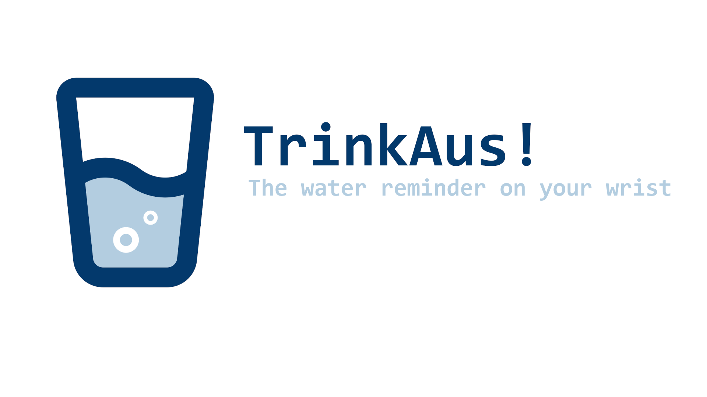
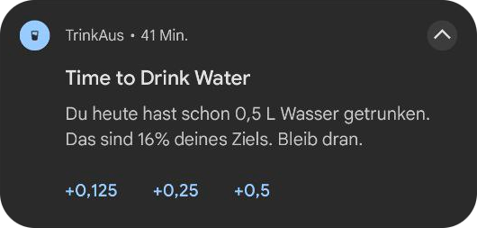
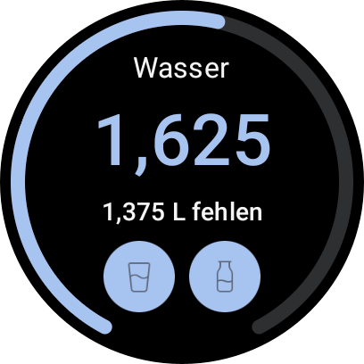

# TrinkAus 💧

<p align="center">
  
</p>

**TrinkAus** is your minimalist companion for staying hydrated. This intuitive app reminds you to drink water every 2 hours and seamlessly integrates with **[Health Connect](https://developer.android.com/health-and-fitness/guides/health-connect)** to keep your hydration data in sync with your favorite health and fitness applications.

Whether you're focused on your daily goals or need a gentle nudge, TrinkAus is designed to fit effortlessly into your lifestyle.

## ✨ Features

*   **💧 Hydration Reminders:** Reminders to drink water, helping you maintain optimal hydration levels throughout the day.
    *   <p align="center"></p>
*   **🔄 Health Connect Integration:** Track your water intake and syncs this data with Health Connect. This allows you to view your hydration progress alongside other metrics in compatible health and fitness apps.
*   **⌚ Companion Wear OS App:** Extend your hydration tracking to your wrist! The Wear OS app provides a convenient way to log water intake and view your progress directly on your smartwatch.
    *   <p align="center"></p>
*   **📊 Progress Tracking:** Monitor your daily water intake against your personalized goals.
*   **🔧 Customizable Settings:** Adjust notification preferences, and daily water intake goals to suit your needs.
*  **📈 Historical Data:** View your hydration history to see how well you've been meeting your goals over time.
*  **🧘 Minimalistic UI:** A clean and straightforward interface focused on ease of use.

## ⚠️ Important Notes

*   **Wear OS Dependency:** The TrinkAus Wear OS app requires the companion phone app to be installed and running on your connected Android phone. This is because the Wear OS app utilizes the phone app to communicate with the Health Connect API for data storage and synchronization.
*   **Flexible Usage:** Use TrinkAus as a standalone water reminder on your phone, or pair it with the Wear OS app for an enhanced, on-the-go experience.

## 🚀 Installation

You can grab the latest official builds from our **[GitHub Releases page](https://github.com/YukiGasai/TrinkAus/releases/latest)**.

### Mobile App (Android Phone)

1.  Download the `trinkaus-mobile.apk` file from the [latest release](https://github.com/YukiGasai/TrinkAus/releases/latest).
2.  Enable installation from unknown sources on your Android device if you haven't already.
3.  Open the downloaded APK file to install the application.

### Wear OS App

The Wear OS app is typically installed alongside the phone app if distributed via the Google Play Store. For direct installation from an APK:

1.  Download the `trinkaus-wear.apk` file from the [latest release](https://github.com/YukiGasai/TrinkAus/releases/latest).
2.  **Enable Developer Options & ADB Debugging on your Wear OS device:**
    *   On your watch, go to **Settings > System > About**.
    *   Tap the **Build number** 7 times until you see "You are now a developer!"
    *   Go back to **Settings > Developer options**.
    *   Enable **ADB debugging**.
3.  **Connect your Wear OS device to your computer:**
4.  **Install the APK using [ADB](https://www.google.com/url?sa=E&q=https%3A%2F%2Fdeveloper.android.com%2Ftools%2Fadb):**
    *   Open a terminal or command prompt on your computer.
    *   Navigate to the directory where you downloaded `trinkaus-wear.apk`.
    *   Run the command:
      ```bash
      adb install trinkaus-wear.apk
      ```

## 🛠️ Building from Source (Optional)

If you wish to build TrinkAus from the source code:

1.  Clone the repository: `git clone https://github.com/YukiGasai/TrinkAus.git`
2.  Open the project in Android Studio (latest stable version recommended).
3.  Build the desired variant (`debug` or `release`) for the `mobile` and/or `wear` modules.

## 🤝 Contributing

Contributions are welcome! If you have ideas for new features, bug fixes, or improvements, please feel free to:

1.  Fork the repository.
2.  Create a new branch for your feature or fix.
3.  Make your changes.
4.  Submit a pull request with a clear description of your changes.

Alternatively, you can open an issue to discuss your ideas or report bugs.

The project is checked using ktlint.

You can run the linter with the following command to check for code style issues:

```bash
./gradlew ktlintCheck
```

## 📄 License

This project is licensed under the [MIT License](./LICENSE) - see the LICENSE file for details.

---

*Stay Hydrated, Stay Healthy!*
